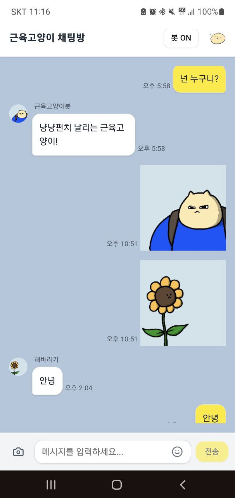

# 💪 근육고양이 채팅앱



실시간으로 소통하는 즐거움을 선사하는 근육고양이 채팅 애플리케이션입니다. Next.js와 Firebase를 기반으로 제작되어 사용자 인증부터 실시간 메시징, 사진 및 이모티콘 전송, 관리자 기능까지 다양한 기능을 제공합니다.

## 🌟 주요 기능

- **⚡ 실시간 채팅**: Firestore를 활용하여 사용자들이 실시간으로 메시지를 주고받을 수 있습니다.
- **🔐 구글 계정 인증**: Firebase Authentication을 통해 간편하고 안전하게 로그인할 수 있습니다.
- **📸 이미지 전송**: 카메라로 직접 사진을 찍거나 갤러리에서 이미지를 선택하여 전송할 수 있으며, `browser-image-compression`을 통해 이미지를 최적화하여 업로드합니다.
- **😻 이모티콘**: 관리자가 직접 추가하고 관리할 수 있는 커스텀 이모티콘을 사용하여 대화를 더 풍부하게 만들 수 있습니다.
- **⌨️ 입력 중 표시**: 상대방이 메시지를 입력하고 있는 상태를 실시간으로 확인할 수 있습니다.
- **🤖 AI 챗봇**: 고객의 질문에 자동으로 응답하는 AI 챗봇(`근육고양이봇`)이 탑재되어 있습니다. (ON/OFF 가능)
- **👨‍💻 관리자 페이지**: 채팅 메시지와 이모티콘을 손쉽게 관리할 수 있는 별도의 어드민 페이지를 제공합니다.
- **📱 PWA 지원**: `@ducanh2912/next-pwa`를 적용하여 웹 앱을 네이티브 앱처럼 설치하고 사용할 수 있습니다.

## 🛠️ 기술 스택

- **프레임워크**: Next.js, React
- **백엔드/데이터베이스**: Firebase (Firestore, Authentication, Storage)
- **상태 관리**: Zustand
- **스타일링**: Tailwind CSS, shadcn/ui
- **아이콘**: lucide-react
- **이미지 최적화**: browser-image-compression

## 🚀 시작하기

프로젝트를 로컬 환경에서 실행하려면 아래의 단계를 따라주세요.

### 1. 전제 조건

- Node.js (v18.18.0 이상)
- npm, yarn, or pnpm

### 2. 설치

1.  **GitHub 리포지토리 복제**
    ```bash
    git clone [https://github.com/your-username/musclecat-chat.git](https://github.com/your-username/musclecat-chat.git)
    cd musclecat-chat
    ```

2.  **의존성 패키지 설치**
    ```bash
    npm install
    # or
    yarn install
    # or
    pnpm install
    ```

3.  **환경 변수 설정**

    프로젝트 루트 디렉터리에 `.env.local` 파일을 생성하고 아래 내용을 채워주세요. Firebase 프로젝트 설정에서 값을 확인할 수 있습니다.

    ```env
    # Firebase
    NEXT_PUBLIC_FIREBASE_API_KEY=your_api_key
    NEXT_PUBLIC_FIREBASE_AUTH_DOMAIN=your_auth_domain
    NEXT_PUBLIC_FIREBASE_PROJECT_ID=your_project_id
    NEXT_PUBLIC_FIREBASE_STORAGE_BUCKET=your_storage_bucket
    NEXT_PUBLIC_FIREBASE_MESSAGING_SENDER_ID=your_messaging_sender_id
    NEXT_PUBLIC_FIREBASE_APP_ID=your_app_id
    ```

### 3. 개발 서버 실행

아래 명령어를 실행하여 개발 서버를 시작합니다.

```bash
npm run dev
# or
yarn dev
# or
pnpm dev
이제 브라우저에서 http://localhost:3000으로 접속하여 앱을 확인할 수 있습니다.

📂 프로젝트 구조
/
├── app/                  # Next.js App Router 페이지 및 레이아웃
│   ├── (main)/           # 메인 앱 라우트 그룹
│   ├── admin/            # 관리자 페이지
│   └── layout.js, page.js, globals.css
├── components/           # 공용 컴포넌트
│   ├── ui/               # shadcn/ui 컴포넌트
│   └── ...
├── hooks/                # 커스텀 훅
├── lib/                  # 라이브러리 및 헬퍼 함수
│   ├── firebase/         # Firebase 관련 설정 및 서비스
│   └── utils.js
├── public/               # 정적 파일 (이미지, manifest.json 등)
├── store/                # Zustand 상태 관리 스토어
└── ...
📜 라이선스
본 프로젝트는 MIT 라이선스를 따릅니다. 자세한 내용은 LICENSE 파일을 참고하세요.